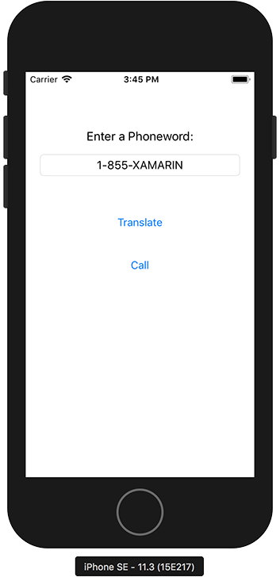

# Phoneword in F# for iOS

This is an exploration of F# for iOS with Visual Studio for Mac. My version in
C# is [here](https://github.com/d108/Phoneword-Csharp).

These tools practically allow for targeting a large number of mainstream
platforms with a high percentage of code re-use at native to near native
performance levels.
